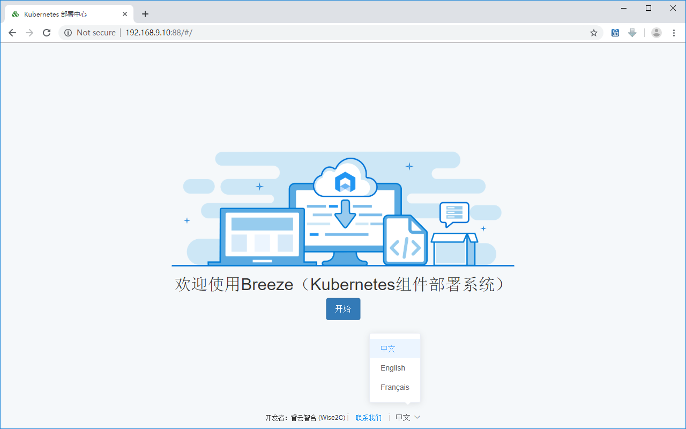
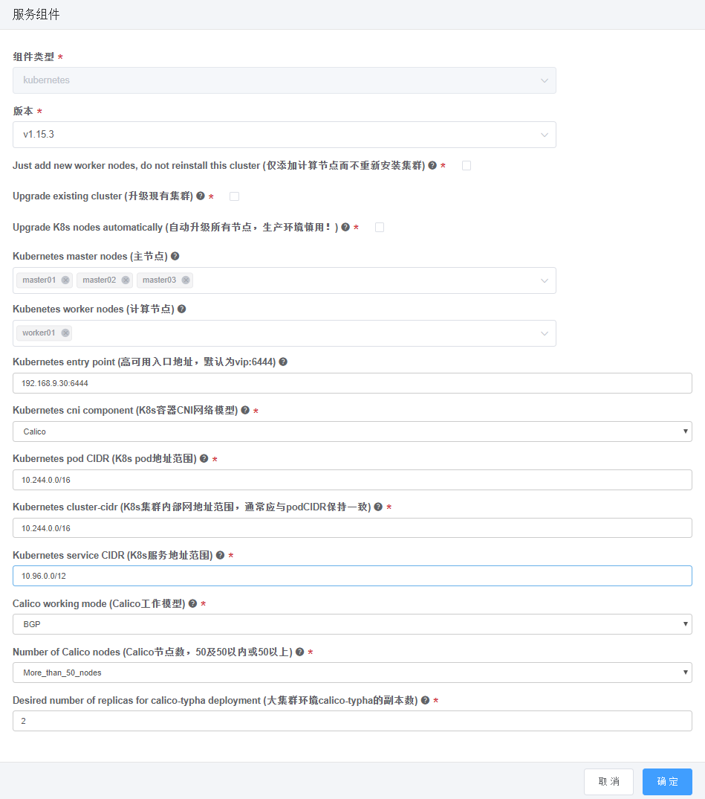

# Breeze - Deploy Kubernetes Cluster with Web UI
[](https://travis-ci.org/wise2c-devops/breeze)

Breeze - Deploy Kubernetes Cluster with Web UI

欢迎使用睿云智合提供的图形化Kubernetes部署工具Breeze

使用该工具，将抹平普通用户学习复杂的kubeadm部署技能学习曲线，体会到一键式部署Kubernetes集群的乐趣！

适用操作系统为RHEL 7.4/7.5 或 CentOS 7.4/7.5

Note:
1. **请不要把Breeze所在的部署主机加入部署集群主机列表**
2. **为了避免包冲突，请使用纯净的CentOS Minimal安装出来的OS来部署集群**
3. **当前版本的CA证书是动态生成的，有效期为100年，其它服务证书有效期为50年。**
4. **本安装方式通过了Kubernetes Conformance一致性认证，因此可用于生产环境。**

常见排错说明在此：
https://github.com/wise2c-devops/breeze/blob/master/TroubleShooting.md

**PDF手册请在此处下载：**

https://github.com/wise2c-devops/breeze/raw/master/manual/BreezeManual.pdf

**大家搜索关注微信公众号【Wise2C】后回复【进群】，睿云小助手会第一时间把拉你进入【 Docker企业落地实践群】，关于Breeze部署工具的问题以及建议我们在群里讨论！**

**软件架构示意图**


操作步骤如下：

1. 软件的使用非常简单，只需要在希望部署的Kubernetes版本分支中下载Breeze的docker-compose.yml文件（Master分支对应Latest Kubernetes版本）

确保您的Linux主机已经安装好了docker以及docker-compose，具体步骤参考以下内容。

（1）对部署机取消SELINUX设定及放开防火墙

```
setenforce 0
sed --follow-symlinks -i "s/SELINUX=enforcing/SELINUX=disabled/g" /etc/selinux/config
firewall-cmd --set-default-zone=trusted
firewall-cmd --complete-reload
```

（2）安装docker-compose命令

```
sudo curl -L https://github.com/docker/compose/releases/download/1.21.2/docker-compose-$(uname -s)-$(uname -m) -o /usr/local/bin/docker-compose
```

```
chmod +x /usr/local/bin/docker-compose
```

(3) 安装docker-io 1.13.1

```
yum install docker
systemctl start docker
systemctl enable docker
```

(4) 下载用于部署某个Kubernetes版本的docker-compose文件并使部署程序运行起来：

[](https://asciinema.org/a/vFYiMG3ptzdYPkS68rcuj4AKK)

例如：

```
curl -L https://raw.githubusercontent.com/wise2c-devops/breeze/v1.12.2/docker-compose.yml -o docker-compose.yml
```

```
docker-compose up -d
```

如果一切正常，部署机的88端口将能够被正常访问。

2. 在部署机上做好对集群内其它所有服务器的ssh免密登录，命令为：

   (1) 生成秘钥 ssh-keygen -t rsa
   
   (2) 针对目标服务器做ssh免密登录
   
       ssh-copy-id 192.168.9.11
       
       ssh-copy-id 192.168.9.12
       
       ssh-copy-id 192.168.9.13
       
       ...

3. 打开浏览器，访问部署程序的图形界面，添加主机列表、添加服务角色并将加入的主机进行角色分配，然后开始部署：



点击 + 号添加一个集群：


点击“添加主机”，输入主机名、主机IP、描述信息（主机用途），点击确定。

重复该步骤直至将集群所需的全部节点服务器加入：

（k8s master服务器、k8s minion node服务器、registry服务器等等）：


点击“添加组件”按钮，对每个组件进行设置和分配服务器：

（Docker角色、etcd角色、registry角色、kubernetes角色）


镜像仓库设置这里的registy entry point是指用户端访问镜像仓库的URL，可以直接写IP地址或写对应的域名：


Etcd可以选择部署于K8S Master节点也可以选择独立的三台主机：


kubernetes entry point是指高可用的一个设定值，如果生产环境有硬件或软件负载均衡指向这里的k8s master所有节点，那么就可以在这里填写负载均衡的统一入口地址。

相对于昂贵的F5专业硬件设备，我们也可以使用HAProxy和Keepalived的组合轻松完成这个设置，详情请参考此处：

https://github.com/wise2c-devops/haproxy-k8s

https://github.com/wise2c-devops/keepalived-k8s

例如下图的 192.168.9.30:6444 就是k8s集群高可用的统一入口，k8s的minion node会使用这个地址访问API Server。




点击“下一步”开始安装部署：


如果界面上所有角色图标全部变为绿色，则表示部署任务结束。可以登录任一k8s节点运行命令 kubectl get nodes 查看结果。


以上例子是3台etcd、3台k8s master、3台k8s minion node、1台镜像仓库的环境。实际可以增减规模。

Kubernetes Dashboard的访问入口我们采用了NodePort:30300的方式暴露端口，因此可以通过 https://node-ip:30300 来访问Dashboard页面。

新版本Dashboard引入了验证模式，可以通过以下命令获取admin-user的访问令牌：

```
kubectl -n kube-system describe secret $(kubectl -n kube-system get secret | grep admin-user | awk '{print $1}')
```

将返回的token字串粘贴至登录窗口即可实现登录。


###########################################################################################

补充说明：

对于Kubernetes集群的HA架构解决方案，我们暂时不放出图形化解决方案，待我们将其从内部版本剥离出来后再贡献给社区：


